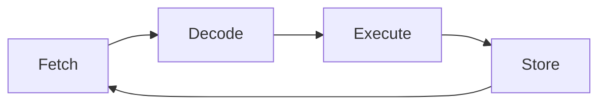

<!-- _class: lead -->
# Conceptos básicos de organización de computadoras
## Organización del Computador 1
### Comisión 7 - UNGS

---

# Arquitectura básica de un computador

- **Unidad Central de Procesamiento (CPU)**
  - Unidad de Control
  - Unidad Aritmético-Lógica (ALU)
  - Registros
- **Memoria**
  - Principal (RAM)
  - Secundaria (Almacenamiento)
- **Dispositivos de Entrada/Salida**
- **Buses de comunicación**

---

# Modelo de Von Neumann

- Arquitectura básica propuesta por John von Neumann en 1945
- Programa almacenado en memoria junto con los datos
- Ejecución secuencial de instrucciones

---

# Ciclo de instrucción

1. **Búsqueda (Fetch)**: Obtener la instrucción de la memoria
2. **Decodificación (Decode)**: Interpretar la instrucción
3. **Ejecución (Execute)**: Realizar la operación
4. **Almacenamiento (Store)**: Guardar el resultado

---

# Sistemas de numeración

- **Decimal (Base 10)**: 0, 1, 2, 3, 4, 5, 6, 7, 8, 9
- **Binario (Base 2)**: 0, 1
- **Octal (Base 8)**: 0, 1, 2, 3, 4, 5, 6, 7
- **Hexadecimal (Base 16)**: 0, 1, 2, 3, 4, 5, 6, 7, 8, 9, A, B, C, D, E, F

---

# Conversión entre sistemas

## Decimal a Binario
$42_{10} = 101010_2$

## Binario a Decimal
$101010_2 = 32 + 8 + 2 = 42_{10}$

## Hexadecimal a Binario
$2A_{16} = 0010 1010_2 = 42_{10}$

---

# Representación de datos

- **Enteros**: Complemento a 2
- **Reales**: Punto flotante (IEEE 754)
- **Caracteres**: ASCII, Unicode
- **Instrucciones**: Códigos de operación (Opcodes)

---

<!-- _class: lead -->
# ¿Preguntas?