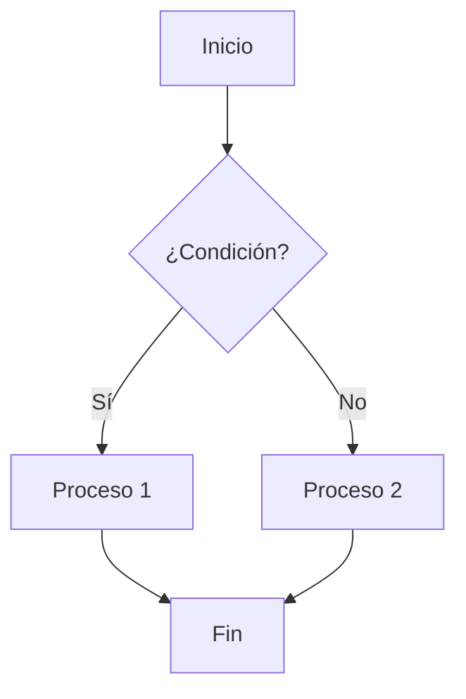

# Guía de Uso - Organización del Computador 1 (Comisión 7)

Esta guía explica cómo utilizar este repositorio para crear y gestionar el contenido de las clases de Organización del Computador 1.

## Índice

- [Guía de Uso - Organización del Computador 1 (Comisión 7)](#guía-de-uso---organización-del-computador-1-comisión-7)
  - [Índice](#índice)
  - [Requisitos previos](#requisitos-previos)
  - [Configuración inicial](#configuración-inicial)
  - [Desarrollo local](#desarrollo-local)
  - [Creación de nuevas diapositivas](#creación-de-nuevas-diapositivas)
    - [Crear una nueva semana](#crear-una-nueva-semana)
    - [Opciones del script](#opciones-del-script)
    - [Editar diapositivas existentes](#editar-diapositivas-existentes)
  - [Uso de temas](#uso-de-temas)
  - [Características avanzadas](#características-avanzadas)
    - [Diagramas con Mermaid](#diagramas-con-mermaid)
    - [Bloques de código](#bloques-de-código)
    - [Fórmulas matemáticas](#fórmulas-matemáticas)
    - [Animaciones](#animaciones)
  - [Generación de PDFs](#generación-de-pdfs)
  - [Publicación en GitHub Pages](#publicación-en-github-pages)
  - [Solución de problemas](#solución-de-problemas)
    - [El servidor de desarrollo no muestra los cambios](#el-servidor-de-desarrollo-no-muestra-los-cambios)
    - [Problemas con Docker](#problemas-con-docker)
    - [Errores en la generación de PDFs](#errores-en-la-generación-de-pdfs)
    - [Problemas con GitHub Actions](#problemas-con-github-actions)

## Requisitos previos

Para utilizar este repositorio, necesitarás:

- Git
- Docker y Docker Compose
- Visual Studio Code con la extensión Remote - Containers
- Una cuenta de GitHub (para publicar en GitHub Pages)

## Configuración inicial

1. Clona el repositorio:

```bash
git clone https://github.com/tu-usuario/Orga1_Com7.git
cd Orga1_Com7
```

2. Asegúrate de que los scripts sean ejecutables:

```bash
chmod +x marp.sh
chmod +x scripts/create-new-week.sh
```

## Desarrollo local

Hay dos formas de trabajar con este repositorio:

### 1. Usando VS Code con devcontainer (recomendado)

Esta opción te permite trabajar dentro de un contenedor Docker con todas las herramientas necesarias ya instaladas:

```bash
./marp.sh dev
```

Esto abrirá VS Code con el proyecto en un contenedor de desarrollo. El contenedor incluye:
- Marp CLI
- Extensiones recomendadas para VS Code
- Soporte para LaTeX
- Todo lo necesario para generar PDFs y publicar en web

### 2. Usando el servidor de desarrollo independiente

Si prefieres usar tu propio editor, puedes iniciar el servidor de desarrollo:

```bash
./marp.sh start
```

Esto iniciará un servidor de desarrollo en http://localhost:8080 que mostrará las diapositivas y se actualizará automáticamente cuando realices cambios en los archivos Markdown.

Para detener el servidor:

```bash
./marp.sh stop
```

## Creación de nuevas diapositivas

### Crear una nueva semana

Puedes crear una nueva carpeta para una semana con el script `create-new-week.sh`:

```bash
./scripts/create-new-week.sh 3
```

Esto creará la carpeta `Semana3` con la estructura básica y dos archivos de diapositivas (`tema1.md` y `tema2.md`).

### Opciones del script

- `-t, --theme`: Especifica el tema a usar (institutional o matrix)
- `-c, --copy`: Copia la estructura de otra semana
- `-n, --topics`: Número de temas a crear

Ejemplos:

```bash
# Crear Semana4 con el tema matrix
./scripts/create-new-week.sh 4 -t matrix

# Crear Semana5 copiando la estructura de Semana2
./scripts/create-new-week.sh 5 -c Semana2

# Crear Semana6 con 3 temas
./scripts/create-new-week.sh 6 -n 3
```

### Editar diapositivas existentes

Simplemente abre los archivos `.md` en tu editor de texto favorito y realiza los cambios. El servidor de desarrollo mostrará los cambios en tiempo real.

## Uso de temas

Este repositorio incluye dos temas:

1. **Institutional**: Tema claro con el color institucional #00759c
2. **Matrix**: Tema oscuro inspirado en las películas Matrix y Terminator

Para usar un tema específico, agrega la siguiente línea en el encabezado YAML de tus diapositivas:

```yaml
---
marp: true
theme: institutional  # o matrix
paginate: true
header: "Organización del Computador 1 - Comisión 7"
footer: "UNGS - 2025"
---
```

## Características avanzadas

### Diagramas con Mermaid

Puedes incluir diagramas usando la sintaxis de Mermaid:

````markdown

````

Consulta la [plantilla de diagramas](templates/diagrams.md) para más ejemplos.

### Bloques de código

Para incluir código con resaltado de sintaxis:

````markdown
```c
#include <stdio.h>

int main() {
    printf("Hola, mundo!\n");
    return 0;
}
```
````

Consulta la [plantilla de código](templates/code.md) para más ejemplos.

### Fórmulas matemáticas

Para incluir fórmulas matemáticas usando LaTeX:

```markdown
Fórmula en línea: $E = mc^2$

Fórmula en bloque:
$$\sum_{i=1}^{n} i = \frac{n(n+1)}{2}$$
```

Consulta la [plantilla de matemáticas](templates/math.md) para más ejemplos.

### Animaciones

Para incluir animaciones básicas:

```markdown
<!-- _class: fade -->
# Esta diapositiva aparece con un efecto de desvanecimiento
```

Consulta la [plantilla de animaciones](templates/animations.md) para más ejemplos.

## Generación de PDFs

Para generar PDFs de todas las diapositivas:

```bash
./marp.sh pdf
```

Los PDFs generados se guardarán en la carpeta `dist/pdf/`.

También puedes generar PDFs directamente desde VS Code cuando estás usando el devcontainer, utilizando la extensión de Marp para VS Code.

## Publicación en GitHub Pages

Cada vez que realices un push a la rama `main`, se ejecutarán automáticamente dos GitHub Actions:

1. **generate-pdfs.yml**: Genera PDFs de todas las diapositivas y los guarda en la carpeta `pdf/`
2. **deploy-website.yml**: Genera un sitio web con todas las diapositivas y lo publica en GitHub Pages

El sitio web estará disponible en: `https://tu-usuario.github.io/Orga1_Com7/`

También puedes generar el sitio web localmente con:

```bash
./marp.sh website
```

Los archivos generados se guardarán en la carpeta `dist/website/`.

## Solución de problemas

### El servidor de desarrollo no muestra los cambios

Intenta reiniciar el servidor:

```bash
./marp.sh stop
./marp.sh start
```

### Problemas con Docker

Asegúrate de que Docker esté en ejecución:

```bash
docker --version
docker-compose --version
```

Si estás usando el devcontainer y encuentras problemas, puedes reiniciar el contenedor desde VS Code:
1. Presiona F1 para abrir la paleta de comandos
2. Escribe "Remote-Containers: Rebuild Container"
3. Presiona Enter

### Errores en la generación de PDFs

Si encuentras errores al generar PDFs, verifica:

1. Que no haya errores de sintaxis en tus archivos Markdown
2. Que las imágenes y recursos externos estén accesibles
3. Que tengas suficiente espacio en disco

### Problemas con GitHub Actions

Si las GitHub Actions fallan, verifica:

1. Los logs de las acciones en la pestaña "Actions" de tu repositorio en GitHub
2. Que la rama `gh-pages` esté configurada correctamente para GitHub Pages
3. Que tengas los permisos necesarios para el repositorio

Si necesitas más ayuda, abre un issue en el repositorio.