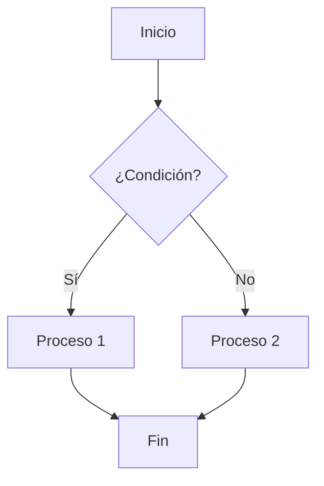
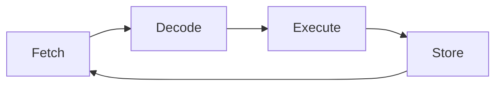
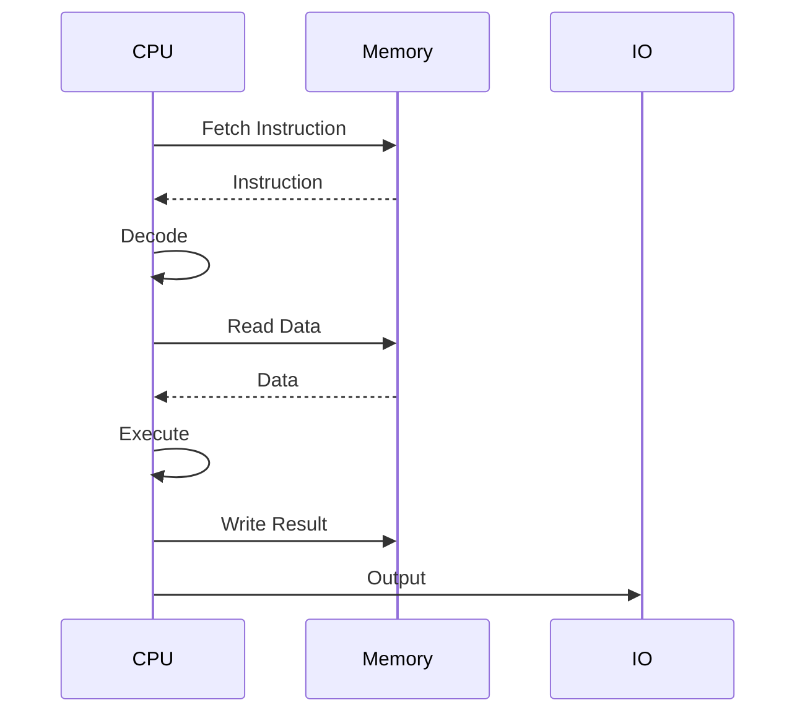
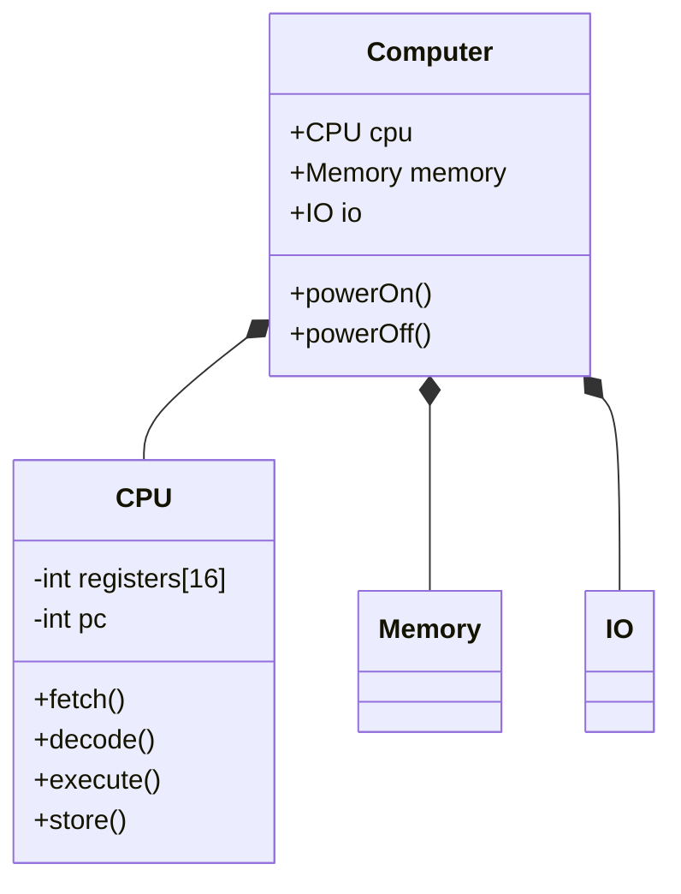
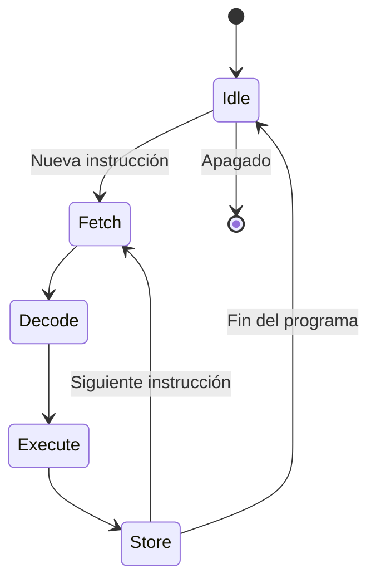
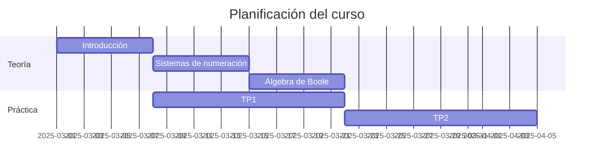
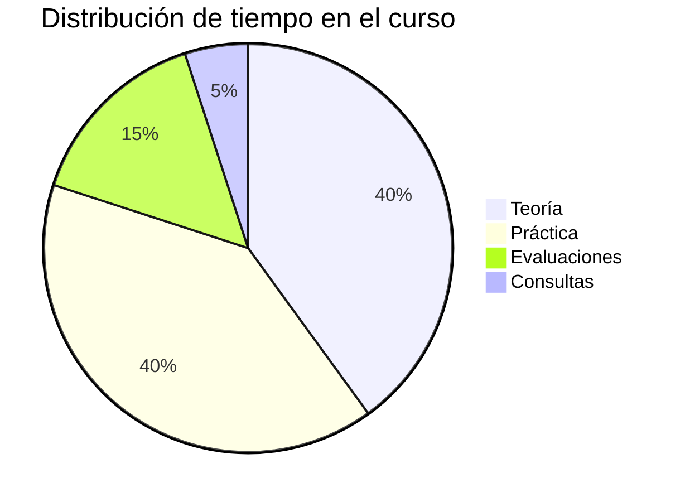

<!-- 
Plantilla para diapositivas con diagramas usando Mermaid
Organización del Computador 1 - Comisión 7 (UNGS)

Mermaid permite crear diagramas y visualizaciones usando texto y código.
Documentación: https://mermaid-js.github.io/
-->

<!-- _class: lead -->
# Diagramas en Marp
## Usando Mermaid
### Organización del Computador 1 - Comisión 7

---

# Tipos de diagramas soportados

- Diagramas de flujo
- Diagramas de secuencia
- Diagramas de clase
- Diagramas de estado
- Diagramas de Gantt
- Diagramas de relación entidad
- Diagramas de pastel
- Y más...

---

# Diagrama de flujo

---

# Diagrama de flujo: Ciclo de instrucción

---

# Diagrama de secuencia

---

# Diagrama de clase

---

# Diagrama de estado

---

# Diagrama de Gantt

---

# Diagrama de pastel

---

# Consejos para usar diagramas

- Mantén los diagramas simples y enfocados
- Usa colores para destacar elementos importantes
- Agrega comentarios explicativos
- Combina diferentes tipos de diagramas según sea necesario
- Prueba los diagramas en el editor de Mermaid antes de incluirlos

---

<!-- _class: lead -->
# ¿Preguntas?